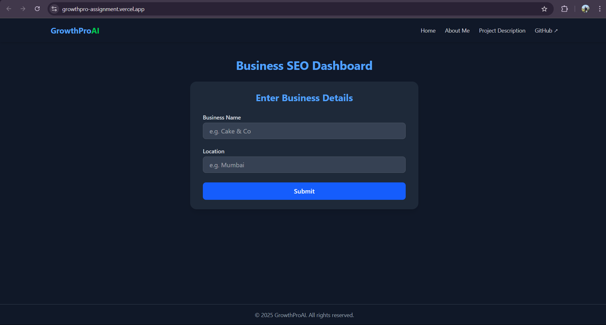

# GrowthProAI Mini Dashboard (Frontend)

This is the frontend part of the GrowthProAI Full Stack Intern Assignment. It allows local businesses to input their name and location to view simulated SEO headlines, mock ratings, and reviews — mimicking a Google Business dashboard experience.

## 🌐 Live Demo (Optional)
[View Live Site](https://growthpro-assignment.vercel.app/)  

---

## 📦 Tech Stack

- **React**
- **Tailwind CSS**
- **Vite**
- **Lucide Icons**
- **Fetch API**

---

## 🚀 Features

- Responsive and mobile-first dashboard UI
- Business name and location input form
- Displays:
  - Mock rating and number of reviews
  - AI-generated SEO headline
- Regenerate SEO headline with one click
- Optimized layout for both desktop and mobile

---

## 📸 Preview



---

## 🛠️ Installation

```bash
cd frontend
npm install
```

---

## 📂 Folder Structure

```
frontend/
├── public/
├── src/
│   ├── components/
│   │   ├── BusinessForm.jsx
│   │   ├── BusinessCard.jsx
│   │   ├── Navbar.jsx
│   │   └── Footer.jsx
│   ├── pages/
│   │   ├── Index.jsx
│   │   └── ProjectDescription.jsx
│   ├── App.jsx
│   └── main.jsx
├── .env               # For backend URL
├── .gitignore
├── tailwind.config.js
└── vite.config.js
```

---

## 🔗 Environment Setup

Create a `.env` file in the `frontend/` directory:

```env
VITE_BACKEND_URL=https://your-backend-url.onrender.com
```

> Replace with your actual backend endpoint

---

## 🧪 Run Locally

Start the frontend app:

```bash
npm run dev
```

Then open [http://localhost:5173](http://localhost:5173) in your browser.

---

## 📤 API Endpoints (Connected to Backend)

- `POST /business-data` – Submits business name/location and gets SEO data
- `GET /regenerate-headline` – Fetches a new SEO headline


---

## 👨‍💻 Author

[Chodagiri N V S S Durga Prasad](https://prasadchodagiri-portfolio.vercel.app/)  
